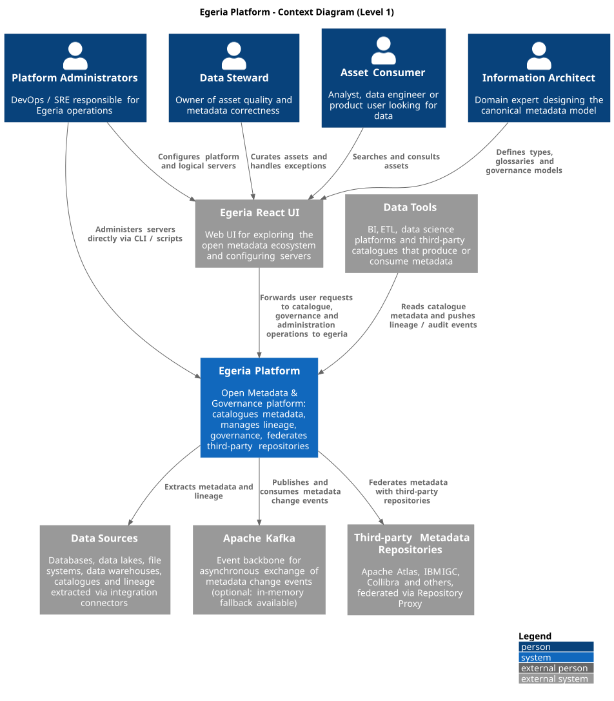
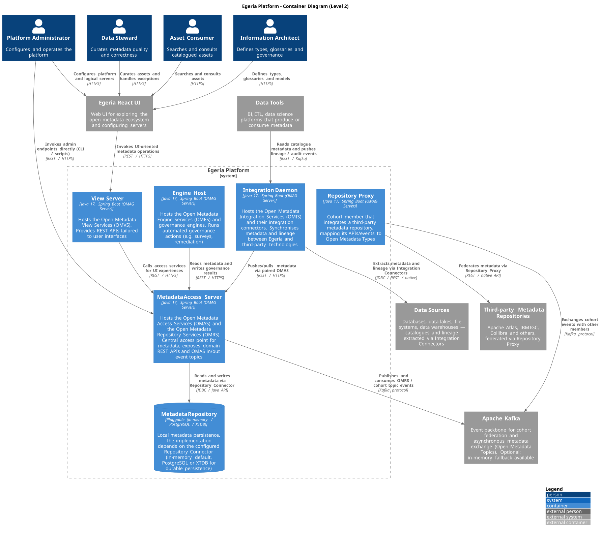
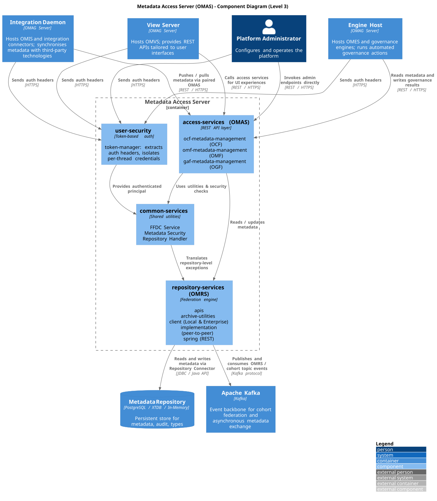
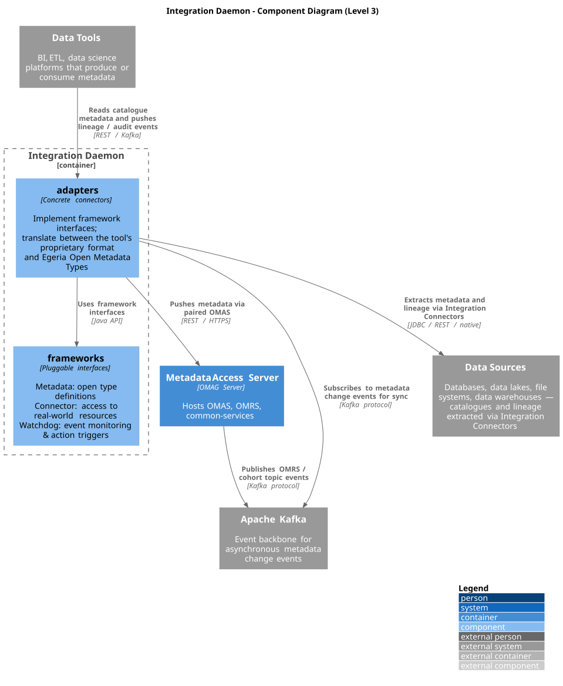

# Software Architecture

## Context Level (C4 — Level 1)

### Diagram



### Description

The context diagram places **Egeria Platform** at the centre as a single black box, showing every external actor and system that interacts with it without exposing internal structure. The scope is a single OMAG Server Platform deployment; cohort federation across multiple Egeria platforms is a runtime capability of OMRS and surfaces in the Container diagram.

### External Actors

| Actor                      | Identity                                                                                |
| -------------------------- | --------------------------------------------------------------------------------------- |
| **Information Architect**  | Domain expert designing canonical metadata types, glossaries, and governance models.    |
| **Data Steward**           | Owner of asset quality and metadata correctness; curates assets and handles exceptions. |
| **Asset Consumer**         | Analyst, data engineer, or product user searching the catalogue for usable data.        |
| **Platform Administrator** | DevOps / SRE responsible for deploying, configuring, and operating Egeria.              |

Actors are grouped by functional role, not job title: this is stable across organisational changes and aligns with the View Services Egeria exposes per role. Compliance, Privacy, and Security Officers are not a separate actor at this level: their work splits between Information Architect (writing governance policies) and Data Steward (enforcing them).

### External Systems

| System                                | Why it is external                                                                                                                                                                     |
| ------------------------------------- | -------------------------------------------------------------------------------------------------------------------------------------------------------------------------------------- |
| **Data Sources**                      | Heterogeneous origins of metadata (databases, lakes, file systems, warehouses). Egeria does not own them; integration connectors crawl them.                                           |
| **Data Tools**                        | BI, ETL and data science platforms that produce or consume metadata via Egeria's REST APIs.                                                                                            |
| **Apache Kafka**                      | Event backbone for asynchronous metadata change events and cohort federation. Real out-of-process service; the in-memory fallback exists only for dev/test.                            |
| **Third-party Metadata Repositories** | Apache Atlas, IBM IGC, Collibra and others. Egeria does not own them; the Repository Proxy federates their metadata by translating between their native model and Open Metadata Types. |
| **Egeria React UI**                   | Web frontend in a separate repository that exposes catalogue, governance, and administration operations to human users and calls Egeria on their behalf.                               |

**Identity Provider, configuration store and secrets store** are infrastructure details reached through pluggable connectors; they appear at L2/L3.

### Key Interactions

| Flow                                                     | Intent                                                                                                                                                                                                           |
| -------------------------------------------------------- | ---------------------------------------------------------------------------------------------------------------------------------------------------------------------------------------------------------------- |
| Architect / Steward / Consumer / Admin → Egeria React UI | Human actors reach Egeria through the web UI, which exposes metadata catalogue, governance and administration operations.                                                                                        |
| Egeria React UI → Egeria                                 | The UI forwards user requests to the platform as metadata and governance operations.                                                                                                                             |
| Admin → Egeria                                           | The administrator also operates the platform **directly** via CLI / scripts, bypassing the UI (e.g. server configuration and lifecycle). This direct channel resurfaces at L2 as Admin → Metadata Access Server. |
| Egeria → Data Sources                                    | Egeria **pulls** schema, lineage and statistics through integration connectors that run inside the platform.                                                                                                     |
| Egeria → Apache Kafka                                    | Egeria publishes and consumes Open Metadata change events; the platform connects to the broker as both publisher and subscriber.                                                                                 |
| Egeria → Third-party Metadata Repositories               | Egeria **federates** metadata with third-party repositories via the Repository Proxy, translating between Open Metadata Types and each repository's native model.                                                |
| Data Tools → Egeria                                      | BI / ETL tools **call Egeria's REST APIs** to read catalogue metadata and to push lineage / audit events. The tools initiate; Egeria does not push to them.                                                      |

Arrows are unidirectional and labelled with intent. Protocol detail belongs in the Container diagram.

## Design notes

- **Pull-first for Data Sources.** Integration connectors live inside Egeria and poll or observe the sources. The push model (sources emitting events to Kafka or to a REST endpoint) exists but is the minority case and is captured at L2.
- **Tools initiate, not Egeria.** Outbound notifications to data tools, when they happen, travel via Kafka rather than via direct calls from Egeria therefore the only L1 arrow between Egeria and Data Tools is _inbound_.
- - **Single platform at L1.** Modelling a cohort as N separate systems at L1 would suggest each platform is independently usable, which is misleading: the
    cohort is a federation property of a single Egeria deployment, not a separate product.

---

## Container Level (C4 - Level 2)

### Diagram



### Description

Each OMAG Server type runs as an independent Spring Boot process on an OMAG Server Platform. They can share one platform instance (dev/test) or be distributed across multiple instances (production). The diagram models the production-style distributed case, where each server type is a separate deployable unit.

### Relationship with Clean Architecture

Clean Architecture (by definition of Robert C. Martin) organises source-code dependencies into four concentric rings: Entities, Use Cases, Interface Adapters, Frameworks & Drivers with one strict rule: **dependencies can only point inward**. Outer rings know about inner rings; inner rings know nothing about outer ones. The goal is to keep domain logic independent from infrastructure so that databases, frameworks, and external tools are swappable without touching business rules.

Egeria's container layout maps onto those rings as follows:

| Clean Architecture ring  | Egeria container                                                                               | Why                                                                                                                                                                                                                                                                                                                                          |
| ------------------------ | ---------------------------------------------------------------------------------------------- | -------------------------------------------------------------------------------------------------------------------------------------------------------------------------------------------------------------------------------------------------------------------------------------------------------------------------------------------- |
| **Entities**             | Core of the **Metadata Access Server** (OMRS)                                                  | The Open Metadata Type System, canonical types, relationships, classifications, is pure domain. No dependency on Spring, Kafka, or any database.                                                                                                                                                                                             |
| **Use Cases**            | Also the **Metadata Access Server** (OMAS)                                                     | The Access Services (Asset Manager, Data Manager, Governance Program) implement application-level metadata workflows. They orchestrate types without knowing how they are stored or transported.                                                                                                                                             |
| **Interface Adapters**   | **View Server, Integration Daemon, Engine Host, Repository Proxy**                             | Each translates between an external concern and the metadata core: the View Server adapts HTTP UI requests into OMAS calls; the Integration Daemon translates third-party data formats into Open Metadata Types; the Repository Proxy maps a foreign repository's model onto OMRS. They all depend on MAS; they do not depend on each other. |
| **Frameworks & Drivers** | **Metadata Repository, Apache Kafka, Data Sources, Third-party Repositories, Egeria React UI** | Concrete infrastructure. Replaceable without touching the business rules, because each is reached through an abstraction defined by the inner layers (Repository Connector, Open Metadata Topic Connector, Integration Connector).                                                                                                           |

**Dependency rule check.** The arrows in the diagram respect the inward rule:

- View Server → MAS, Integration Daemon → MAS, Engine Host → MAS: adapters calling the core. ✓
- MAS → Metadata Repository: the dependency is on the _Repository Connector interface_ (defined inside OCF, the core framework), not on PostgreSQL or in-memory directly. The concrete driver lives in the outermost ring and is injected at startup. ✓
- MAS → Apache Kafka: similarly mediated by the _Open Metadata Topic Connector_ abstraction. ✓

**Main deviations from strict Clean Architecture:**

1. **Collapsed inner rings.** MAS bundles both the Entity layer (OMRS, type system) and the Use Case layer (OMAS business rules) into one deployable unit. The boundary between them exists in the source code but is invisible at L2; it only becomes visible at L3. This is a deliberate design choice: separating OMRS and OMAS into two independent processes would create distributed coupling with no architectural gain, since every OMAS call needs synchronous access to the type system.
2. **Framework ubiquity.** All five OMAG Server types are built on Spring Boot, meaning the Frameworks & Drivers ring is present inside every container. This is an unavoidable characteristic of microservice architectures. The risk, that framework concerns bleed into business logic, is mitigated by the OCF connector boundary, which forces all infrastructure access through interfaces owned by the inner layers.

---

## Component Level (C4 — Level 3)

Egeria comprises about 14 OMAG Server types. The two analysed here, **Metadata Access Server** and **Integration Daemon**, are the most relevant for understanding the core metadata flow, as confiremd by the dependency analysis, where `repository-services`, `access-services`, `adapters`, and `frameworks` show the highest inter-module import counts in the entire codebase.

### Metadata Access Server



The Metadata Access Server is the central container of the architecture. It is called by four distinct containers: **View Server**, **Integration Daemon**, **Engine Host**, and **Platform Administrator**, each with a dedicated interaction. Internally it is structured into four components:

- **`access-services (OMAS)`**: the REST API layer for all metadata operations, divided into domain-specific sub-modules:  
   -_ocf-metadata-management_: provides metadata management for the Open Connector Framework (OCF); - _omf-metadata-management_: provides metadata management for the Open Metadata Framework (OMF); - _gaf-metadata-management_: provides metadata management for the Open Governance Framework (OGF).
  Each sub-module exposes its own set of properties and APIs.
- **`repository-services (OMRS)`**: when a project borns is composed by a small number of interfaces, this number increases during the development and several interfaces are present, as consequence multiple silos of metadata are created. The goal of OMRS is to bring these repositories together so metadata are linked and can work together. Sub-modules:
  - _apis_: connector interfaces and event structures for the repository service;
  - _archive-utilities_: provides utilities to build Open Metadata Archives;
  - _client_: calls two client implementations — the _Local Repository Services Client_ for calls to a local repository and the _Enterprise Repository Services Client_ for calls to the enterprise-wide federated repository;
  - _implementation_: support for peer-to-peer federation logic;
  - _spring_: Spring annotations that expose OMRS capabilities as REST services.
- **`common-services`**: shared Java utilities consumed by both clients and the specialised services running in the OMAG Server. Key sub-modules include:
  - _First-Failure Data Capture (FFDC) Service_: common exception handling and error reporting.
  - _Metadata Security_: authorisation of access to OMAG services and individual metadata instances.
  - _Repository Handler_: mediates access to multiple related metadata instances from OMRS, translating repository-level exceptions into the exception types used by the access services.
- **`user-security`**: token-based authentication layer. Credentials extracted from incoming HTTP request headers are stored in thread-local storage and propagated to runtime modules and security connectors. The core sub-module is _token-manager_, which implements this extraction and distribution mechanism.

### Integration Daemon



The Integration Daemon is responsible for continuous, bidirectional metadata synchronisation between Egeria and third-party technologies. It is structured into two components:

- **`adapters`**: concrete integration connectors that implement communication with specific external tools (BI platforms, ETL tools, data catalogues, etc.). Adapters push and pull metadata to and from the Metadata Access Server via the paired OMAS, and subscribe to metadata change events from Apache Kafka to stay synchronised in real time.
- **`frameworks`**: pluggable interfaces defining the contracts for all integration components. They provide the customisation and technology-integration points of the open metadata and governance implementation. There are three main interface families:
  - _Metadata_: base definitions for Open Metadata Type;
  - _Connector_: interfaces for access to real-world digital resources;
  - _Watchdog_: event-monitoring interfaces that trigger actions in response to metadata changes.

### Excluded Containers

**View Server**, **Engine Host**, and **Repository Proxy** were excluded. The View Server is an adapter with no domain logic, its behaviour is fully determined by the access services. The Engine Host mirrors the Integration Daemon and its patterns are covered in the relative analysis. The Repository Proxy maps a third-party repository's API to OMRS events, so it is connector-level detail rather than architectural. The two chosen containers cover the highest concentration of cross-module dependencies and together cover the full metadata lifecycle.

### SOLID Violations

**SRP — `JacquardIntegrationConnector`**: which is responsible to assemble all the **Open Metadata Digital Product Catalog** that is composed by several components like catalogs, glossaries or dictionaries. Each of them has its own set of elements and properties, all within a single class.

```java
public class JacquardIntegrationConnector extends CatalogIntegratorConnector {
  private void refreshDigitalProductCatalog() { ... }
  private void refreshGlossaries()            { ... }
  private void refreshDataDictionaries()      { ... }
}
```

**OCP — `AccessServiceDescription`**: allows the addition of new adapters without overturn the code. However, if a completely new standard of metadata is introduced, all the core as _access-services_ or _repository-services_ might require great modifications on the logic, not only extensions of interfaces, and as consequence there iss the OCP violation.

```java
public enum AccessServiceDescription {
    OCF_METADATA_MANAGEMENT(...),
    OMF_METADATA_MANAGEMENT(...),
    GAF_METADATA_MANAGEMENT(...);
    // NEW_STANDARD_MANAGEMENT(...)  <-- requires modifying this enum
}
```

**ISP — `OMRSMetadataCollection`**: this abstract class in _repository-services-apis_ aggregates all methods for managing entities, relationships, types, and classifications into a single abstract class. If a component needs a subset of these operations must depend on the entire interface, violating the Interface Segregation Principle.

```java
public abstract class OMRSMetadataCollection {
    public abstract TypeDefGallery getAllTypes(...);
    public abstract EntityDetail addEntity(...);
    public abstract EntityDetail updateEntityProperties(...);
    public abstract List<EntityDetail> findEntitiesByProperty(...);
}
```

**LSP — Repository connectors**: in a project of this scale it is not easy for every repository connector to support the full operation set defined by the superclass. Adapters often throw `FunctionNotSupportedException`, violating the substitution principle and risking runtime crashes in callers that assume full interface compliance.

```java
@Override
public EntityDetail isEntityKnown(String userId, String guid)
        throws FunctionNotSupportedException {
    throw new FunctionNotSupportedException(
            OMRSErrorCode.METHOD_NOT_IMPLEMENTED.getMessageDefinition(),
            this.getClass().getName(), "isEntityKnown");
}
```

**DIP — `OMAGServerPlatformCatalogConnector`**: High-level modules should not depend on low-level modules; both should depend on abstractions. Especially within the `frameworks` module, there are still instances of tight coupling where high-level modules depend on concrete implementations. An example is found in the `OMAGServerPlatformCatalogConnector`, which directly instantiates the concrete class `SoftwareServerProperties` via the `new` keyword:

```java
SoftwareServerProperties softwareServerProperties = new SoftwareServerProperties();
softwareServerProperties.setQualifiedName(...);
```

---

## Architectural Characteristics

### Architectural Style

Egeria follows a **modular, plugin-based, event-driven service architecture**. The system is decomposed into a set of independent OMAG Servers (Metadata Access Server, Integration Daemon, Engine Host, View Server, Repository Proxy), each deployable and scalable independently (modular). All cross-server and cross-repository communication is mediated by two mechanisms: synchronous REST calls for request/response interactions, and asynchronous Apache Kafka topics for metadata change propagation and cohort federation (event-drien). Extensibility is built into the core through the `frameworks` abstraction layer, which defines pluggable interfaces that connectors and adapters implement without touching the platform internals (plugin-based).

### Architectural Qualities

- **Extensibility**: defines the quality of Egeria. The `frameworks` + `adapters` plugin model allows new connectors, metadata standards, and governance services to be added without modifying the platform core. New integrations require only a new provider/connector pair implementing the relevant framework interface.
- **Scalability**: is a consequence of the division into multiple containers (e.g., _Metadata Access Server_, _Integration Daemon_) and their independence. Each OMAG Server type is an independently deployable Spring Boot process. This means the Integration Daemon (responsible for metadata ingestion from external tools) and the Engine Host (responsible for governance automation) can be scaled horizontally and independently of the Metadata Access Server, based on their respective workloads. Multiple Integration Daemons can run in parallel against different data sources without any coordination overhead on the MAS side.
- **Maintainability**: separation of responsabilities across `access-services`, `repository-services`, and `common-services` allows localised changes to the major part of the project. However, `frameworks` operates as a central hub imported by almost every other module, this implies that changes to its interfaces increase the propagation of various risks in the codebase; must be managed carefully.
- **Security**: managed by the `user-security` module, which implements a token-based authentication and authorization system, through `token-manager` module, ensuring isolation for concurrent requests. The module `common-services` contains the _Metadata Security_ service that manages access to individual metadata instances.
- **Performance**: optimized by the presence of connectors that when there is a change publish an event on a notification channel that is immediately received by all other tools to be updated. This is an event-driven tool, Apache Kafka, which decouples producers from consumers and allows a real-time synchronization of data in the system, without polling. This avoids synchronous fan-out to all subscribers on every write operation.
- **Resilience**: Apache Kafka acts like a buffer between MAS and its consumers. If an Integration Daemon is temporarily unavailable, the MAS can work normally because events are stored in the Kafka queue and processed when the service comes back online. An in-memory fallback is available for development and testing scenarios where a Kafka broker is not present.

### Coupling and Cohesion

A structural and co-change analysis (Design report, Sections A1 and A2) reveals a system with a strongly coupled core and uneven cohesion across modules.

**Cohesion** measures how much a module influences a single responsibility. A module with high cohesion does one thing well; a module with low cohesion tends to change for many different reasons. In Egeria, `JacquardIntegrationConnector` is an example of low cohesion: it assembles the entire Open Metadata Digital Product Catalog in a single class, handling catalogs, glossaries, dictionaries, reference data, and governance actions, violating the single responsability principle. While, `CommunityMattersResource` shows high cohesion: it only exposes HTTP endpoints and immediately delegates every call to `CommunityMattersRESTServices`, resulting in a single Egeria import and a tightly focused responsability.

- **Structural coupling (code)**:
  - **Central hubs**: `frameworks`, `repository-services`, and `access-services` act as architectural hubs. `frameworks` is the most critical, imported by almost every other module in the system. All connectors and services depend on `frameworks` and as consequence some change to a framework propagate risks to the entire codebase.
  - **SOLID-driven coupling**: coupling is amplified by SOLID violations such as the interface `OMRSMetadataCollection` (ISP) and the direct instantiation of concrete classes like `SoftwareServerProperties` (DIP), which prevent the compiler from enforcing the boundary between abstraction and implementation.

**Logical coupling (co-change)**:

- **Over-coupling**: Some Search Executor classes, such as `FindEntitiesByClassificationExecutor` and `FindEntitiesByPropertyValueExecutor`, are often changed together. This suggests that they share similar or duplicated logic. Introducing a common base class could reduce duplication and make maintenance easier.
- **Hidden dependencies**: The `.omarchive` content-pack files are almost always modified together. Although they are stored as separate files, they behave like a single component. This dependency is not visible in the code structure and can only be discovered by analyzing the change history, making maintenance more difficult and risky.
