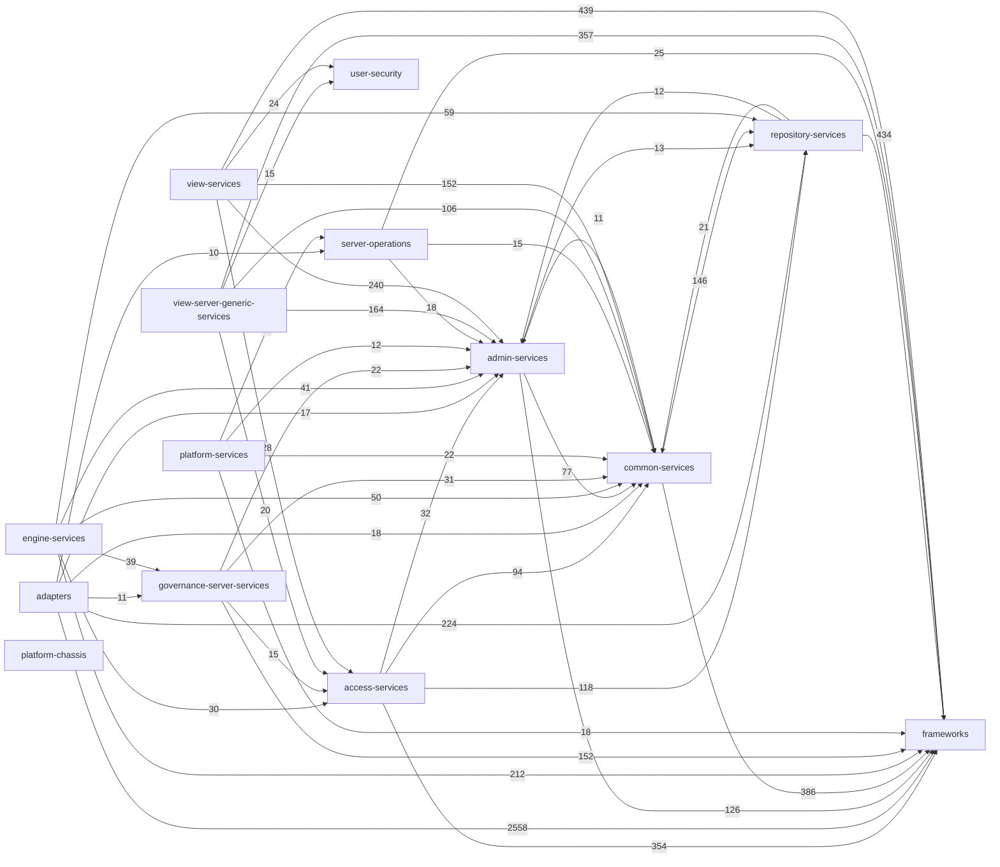
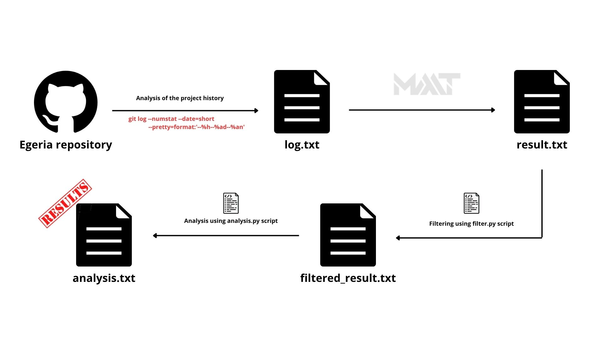
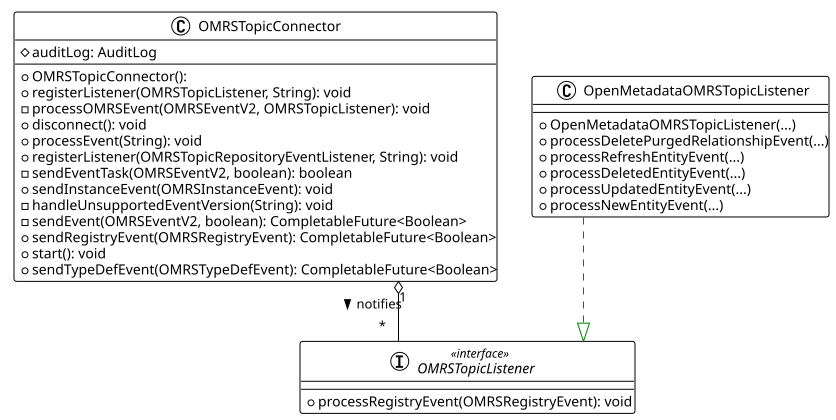
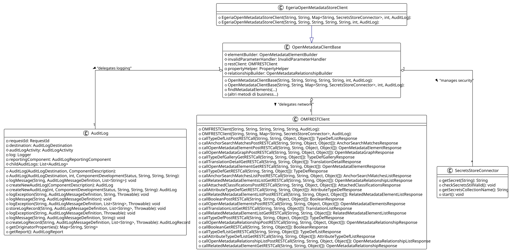
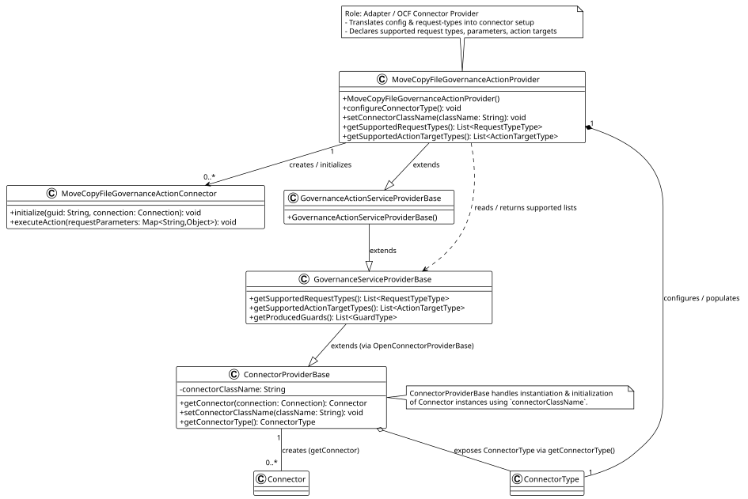
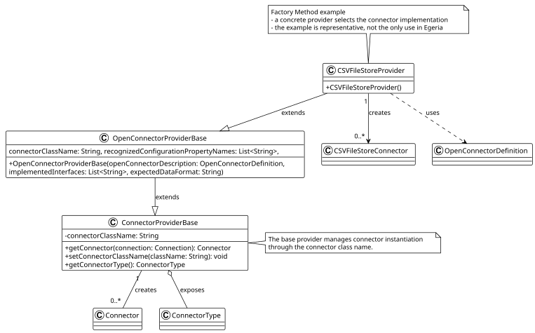

# Software Design

## Code Dependencies

### Methodology

**[Depends](https://github.com/multilang-depends/depends)** (v0.9.7) was used for the initial static analysis of the source code. The following command was run against the Egeria source tree to produce a JSON [dependency matrix](/analysis/data/code-dependencies/imports-matrix.json):

```bash
java -Xmx4g -jar ./depends.jar java ./egeria output -f json -s -d ./deps-output
```

A custom Python [script](/analysis/scripts/code-dependencies/dependency-analysis.py) then processed this output to compute the final statistics. All code dependency counts refer to **`import` declarations** in the source files.


---

### File Dependency Rankings

#### Highest Outgoing Imports

| Imports | File |
|---------|------|
| 56 | `nanny-connectors/.../JacquardIntegrationConnector.java` |
| 51 | `repository-services-apis/.../OMRSMetadataCollection.java` |
| 51 | `open-metadata-framework/.../OpenMetadataPropertyConverterBase.java` |

`JacquardIntegrationConnector` ranks highest because it implements the **Open Metadata Digital Product Catalog** — a unified registry that groups and exposes metadata assets (datasets, APIs, reports, etc.) as *digital products* that other teams can discover and subscribe to. Assembling this catalog entirely within a single class requires handling multiple distinct domains: product catalogs (i.e. the internal folder and collection structure that organizes products), solution blueprints, reference data sets, governance actions, communities, glossaries, and data dictionaries. Each domain brings its own set of property beans, metadata elements, and context types, resulting in a high number of imports.

#### Lowest Outgoing Imports

| Imports | File |
|---------|------|
| 1 | `community-matters-spring/.../CommunityMattersResource.java` |
| 1 | `open-metadata-framework/.../DataMappingProperties.java` |
| 1 | `open-metadata-framework/.../ConceptBeadAttributeProperties.java` |

`CommunityMattersResource` ranks lowest because it is the Spring REST controller for **Community Matters OMVS** — the view service that manages communities, i.e. groups of people organized around a common theme or governance program within an organization. The controller's only responsibility is to expose HTTP endpoints and immediately forward each call to `CommunityMattersRESTServices`, which holds all the actual logic. Since the class contains no business logic and never manipulates Egeria domain types directly, it has a single dependency: `CommunityMattersRESTServices` itself.

#### Most Imported Files

| Imported by | File |
|-------------|------|
| 863 | `open-metadata-framework/.../OpenMetadataType.java` |
| 631 | `audit-log-framework/.../AuditLog.java` |
| 574 | `open-metadata-framework/.../InvalidParameterException.java` |

---

> Since the files with the highest number of both incoming and outgoing imports belong to the `open-metadata-implementation` module, further analyses were conducted to better understand its internal structure.

---

### Observed Structural (Code-Level) Dependencies

#### Implementation Dependency

- **Source:** `egeria-system-connectors/.../OMAGServerPlatformCatalogConnector.java`
- **Depends on:** `open-metadata-framework/.../SoftwareServerProperties.java`

The connector pattern-matches against the concrete type and calls methods on it directly:

```java
if (softwareServer.getProperties()
        instanceof SoftwareServerProperties softwareServerProperties)
    softwareServerProperties.getDeployedImplementationType();
```

#### Construction Dependency

- **Source:** `egeria-system-connectors/.../OMAGServerPlatformCatalogConnector.java`
- **Depends on:** `open-metadata-framework/.../SoftwareServerProperties.java`

The connector directly instantiates `SoftwareServerProperties` via `new` and populates it before use:

```java
SoftwareServerProperties softwareServerProperties = new SoftwareServerProperties();
softwareServerProperties.setQualifiedName(…);
```

#### Compile-Time Dependency

- **Source:** `multi-tenant/.../OMAGServerInstanceAuditCode.java`
- **Depends on:** `audit-log-framework/.../AuditLogMessageSet.java`

The enum declares `AuditLogMessageSet` only in its type signature — no calls or instantiations, purely a compiler-level contract:

```java
public enum OMAGServerInstanceAuditCode implements AuditLogMessageSet { … }
```

---

### Module Dependency Graph

> Edge weights = total `Import` count between submodules of `open-metadata-implementation`. Only edges with ≥ 10 imports are shown.




## Knowledge Dependencies


The co-dependency analysis was performed using CodeMaat, following this workflow:



Using file `analysis.txt`, I derived the following conclusions.


### Hub analysis

- **`Content packs (.omarchive)`**  
  These files contain definitions of data models. If you change the data model, you need to update almost everything else.

- **`open-metadata-conformance-suite`**  
  The testing system is deeply integrated. It's a sign of software maturity, but it also indicates that every change to the core APIs requires a massive update of compliance testing.

- **`Infrastructure & DevOps`**  
  Files like Dockerfile, build.gradle, and GitHub workflows show a co-dependency related to the build and deployment process.

### Coupling analysis

- **`Content packs (.omarchive)`**  
  Content pack files have 100% of coupling, this means that there is a very high cohesion between the content packages. 
  This suggests that, although they are physically separate, they logically form a single information block. 
  Splitting these dependencies in the future may be difficult.

- **`Enterprise Executors` (inside `repository-services` package)**   
  Search executors (e.g., FindEntitiesByClassificationExecutor vs FindEntitiesByPropertyValueExecutor) show very high coupling (100%–92%).
  This suggests code duplication or highly similar logic (if a bug appears in one, it is likely present in the other as well).
  It can be usefull estract common logic in a unique class.


- **`.gradle and .config files`**  
  Co-changes among configuration files are expected, but frequent or widespread coupling may indicate tight module dependencies (.gradle) or duplicated configuration logic (.config), reducing maintainability.


### Inconsistencies with code dependencies

After a comprehensive data analysis conducted using Pandas (a detailed explanation of the methodology can be found in file [analysis_explanation.md](../analysis/scripts/inconsistency_analysis/analysis_explanation.md)), package pairs were classified according to their levels of code-dependency and co-dependency.

The most critical and interesting inconsistencies are those classified as HIDDEN_DEPENDENCY. <br> 
They occur when the direct code dependency is low, while the logical/historical coupling is high. <br>
This indicates a potential <u>*maintenance risk*</u> : modifying one package may unintentionally break another without the compiler providing clear warnings.

Below are the most relevant cases grouped by thematic area:


#### <u>1. Connectors and Repository Architecture (Most Critical Area)</u>
These packages are responsible for data integration and persistence-layer management.
The presence of high logical coupling despite low structural dependency suggests the existence of implicit assumptions and hidden coordination mechanisms within the codebase.

| Package A | Package B |
|:----------|:----------|
| `adapters.repositoryservices.inmemory.repositoryconnector`                         | `adapters.repositoryservices.rest.repositoryconnector`        | 
| `adapters.repositoryservices.rest.repositoryconnector`                             | `repositoryservices.rest.server`                              |
| `repositoryservices.connectors.stores.metadatacollectionstore.repositoryconnector` | `repositoryservices.localrepository.repositorycontentmanager` |

From a software architecture perspective, decoupling in-memory and REST connectors from backend server implementations is considered a good design practice. However, the high co-dependency observed between these components indicates that modifications in one package are consistently reflected in the others.
This behavior suggests the existence of undocumented behavioral contracts, shared assumptions, or implicit synchronization between modules, which increases maintenance complexity and the risk of unintended side effects during evolution activities.

<br>

#### <u>2. Misalignment Between Client and Server/Spring Layers</u>

In a clean distributed architecture, client components and Spring-based server controllers should ideally interact only through well-defined APIs, DTOs (Data Transfer Objects), or shared interfaces.
The analysis, however, reveals the presence of strong hidden logical dependencies between these layers.

| Package A | Package B |
|:----------|:----------|
| `repositoryservices.clients` | `repositoryservices.rest.server.spring` | 
| `adminservices.client`       | `adminservices.spring`                  |
| `platformservices.client`    | `platformservices.server`               |

The observed pattern is consistent with the expected evolution of distributed service interfaces. The low structural dependency confirms the separation between client and server implementations, while the logical coupling reflects the coordinated evolution required by shared communication contracts.

<br>

#### <u>3. Security and Governance Components</u>

The analysis also highlights hidden logical coupling within security-related and governance-oriented modules.

| Package A | Package B |
|:----------|:----------|
| `metadatasecurity.connectors`                | `metadatasecurity.server`                            | 
| `adapters.connectors.governanceactions.ffdc` | `adapters.connectors.governanceactions.provisioning` |

The relationship between metadatasecurity.connectors and metadatasecurity.server suggests that security connectors are tightly coupled to the server-side implementation logic, despite the absence of strong explicit structural dependencies.
The co-evolution observed between governanceactions.ffdc (First Failure Data Capture) and governanceactions.provisioning indicates that failure-management mechanisms and governance provisioning workflows are strongly interconnected at the logical level.
These findings may reveal critical maintenance hotspots, where architectural modularity is only partially achieved in practice.

<br><br>

The vast majority of the remaining package pairs in the dataset exhibit LOW - LOW values and are therefore correctly classified as UNRELATED or NORMAL.
These cases do not represent architectural anomalies.

<br><br>

# Patterns

## Observer Pattern

The pattern is often referred to as the Publish-Subscribe pattern in distributed systems.

### 1. Involved Classes and Roles
* **`OMRSTopicConnector` (Subject):** This class acts as the Subject. it maintains the registry of listeners and is responsible for receiving events from the underlying event bus (e.g., Kafka) and notifying all registered observers.
* **`OMRSTopicListener` (Observer Interface):** The interface that defines the contract for any component wishing to receive metadata events. It contains callback methods like `processRegistryEvent` and `processTypeDefEvent`.
* **`OpenMetadataOMRSTopicListener` (Concrete Observer):** A specific implementation that reacts to the events. It contains the actual business logic to be executed (e.g., updating a local cache or triggering a governance action) when a notification is received.

### 2. Motivation: which problem it solves
Egeria operates in a **Federated Metadata Architecture**. Metadata is distributed across multiple independent repositories (the "Cohort"). 
The Observer pattern solves the **decoupling and synchronization problem**: 
* It allows repositories to stay synchronized without having direct dependencies on each other. 
* The Subject does not need to know the identity or the number of Observers. 
* It enables a highly scalable environment where new services can join the metadata exchange simply by registering a new listener.

### 3. Alternative to the pattern: pros and cons
**Alternative: Synchronous Calls**
* **Pros:** Strong consistency (the caller knows immediately if the update was successful).
* **Cons:** High coupling; if one server in the cohort is down, the entire update process might fail or hang (low resilience).

### 4. Direct links to code (GitHub permalink)
* [OMRSTopicListener.java (Interface)](https://github.com/odpi/egeria/blob/master/open-metadata-implementation/repository-services/repository-services-apis/src/main/java/org/odpi/openmetadata/repositoryservices/connectors/omrstopic/OMRSTopicListener.java)
* [OMRSTopicConnector.java (Subject)](https://github.com/odpi/egeria/blob/master/open-metadata-implementation/repository-services/repository-services-apis/src/main/java/org/odpi/openmetadata/repositoryservices/connectors/omrstopic/OMRSTopicConnector.java)
* [OpenMetadataOMRSTopicListener.java (Concrete Observer)](https://github.com/odpi/egeria/blob/master/open-metadata-implementation/access-services/omf-metadata-management/omf-metadata-server/src/main/java/org/odpi/openmetadata/frameworkservices/omf/listener/OpenMetadataOMRSTopicListener.java)

### 5. UML diagram



## Facade Pattern (Open Metadata Store Client)

### 1. Involved Classes and Each One's Role
* **`EgeriaOpenMetadataStoreClient` (Facade):** This is the concrete Facade class. It provides a simplified, unified interface to the Open Metadata Framework (OMF). It is the primary entry point for developers who need to perform metadata operations without dealing with the internal technicalities of the framework.
* **`OpenMetadataClientBase` (Base Facade / Orchestrator):** An abstract base class that manages the shared infrastructure for various clients. It coordinates the interactions between different subsystems such as REST communication, security, and logging.
* **`OMFRESTClient` (Subsystem):** A complex subsystem responsible for low-level HTTP communication. It handles JSON serialization/deserialization and the execution of REST calls to the OMAG Server Platform.
* **`AuditLog` (Subsystem):** A subsystem that provides diagnostic logging capabilities. It ensures that all client activities are correctly recorded for audit purposes.
* **`SecretsStoreConnector` (Subsystem):** A specialized subsystem that manages security tokens and authentication. It shields the client from the complexities of bearer token management and secret storage.

### 2. Motivation: Which Problem It Solves
The Open Metadata Framework (OMF) within Egeria is an extremely large and modular system. Interacting directly with the underlying subsystems would require a developer to manually manage REST connections, handle complex security handshakes via secret stores, and configure audit logging for every single operation. 

The Facade pattern solves the **complexity and interface pollution** problems by:
* Providing a high-level Java API that hides the network plumbing (REST).
* Encapsulating the initialization and coordination of multiple subsystems (Security, Logging, REST).
* Reducing the learning curve for third-party developers who only need to "search" or "maintain" metadata without understanding the entire OMRS/OMF internal stack.

### 3. Alternative to the Pattern: Pros and Cons
**Alternative: Direct Subsystem Access**
* **Pros:** Provides maximum flexibility, allowing access to low-level features not exposed by the Facade.
    * Avoids the overhead of an additional abstraction layer.
* **Cons:**  High Coupling. Any change in the internal REST protocol or security management would break all client applications.
    * **Complexity:** Developers must write significant boilerplate code to manage connections and authentication.
    * **Error Prone:** Improper handling of low-level components can lead to inconsistent metadata states or security vulnerabilities.

### 4. Direct Links to Code (GitHub Permalink)
* [`EgeriaOpenMetadataStoreClient.java` (Facade)](https://github.com/odpi/egeria/blob/88c26bef1db455222c61a99d62ef0c47f1fb67c3/open-metadata-implementation/access-services/omf-metadata-management/omf-metadata-client/src/main/java/org/odpi/openmetadata/frameworkservices/omf/client/EgeriaOpenMetadataStoreClient.java)
* [`OpenMetadataClientBase.java` (Base Infrastructure)](https://github.com/odpi/egeria/blob/88c26bef1db455222c61a99d62ef0c47f1fb67c3/open-metadata-implementation/access-services/omf-metadata-management/omf-metadata-client/src/main/java/org/odpi/openmetadata/frameworkservices/omf/client/OpenMetadataClientBase.java)
* [`OMFRESTClient.java` (REST Subsystem)](https://github.com/odpi/egeria/blob/88c26bef1db455222c61a99d62ef0c47f1fb67c3/open-metadata-implementation/access-services/omf-metadata-management/omf-metadata-client/src/main/java/org/odpi/openmetadata/frameworkservices/omf/client/rest/OMFRESTClient.java)

### 5. UML Diagram



## Adapter Pattern

### 1. Involved Classes and Roles
* **`MoveCopyFileGovernanceActionProvider` (Adapter):** This concrete provider adapts the governance framework to the specific move/copy/delete file behavior. It translates framework-level configuration into the connector-specific setup.
* **`GovernanceActionServiceProviderBase` (Base Adapter):** This abstract base class supplies the common behavior for governance action service providers and standardizes the information exposed to the framework.
* **`GovernanceServiceProviderBase` (Common Service Base):** This base class defines the shared capabilities for governance services, such as supported request types, request parameters, action targets and produced guards.
* **`OpenConnectorProviderBase` and `ConnectorProviderBase` (Infrastructure):** These classes provide the reusable connector-provider machinery that creates connector instances from a class name and exposes the connector type metadata.
* **`MoveCopyFileGovernanceActionConnector` (Adaptee):** This is the concrete connector that contains the real file operation logic.

### 2. Motivation: Which Problem It Solves
Egeria must support many different connectors while keeping the framework stable and uniform. The Adapter pattern solves the **integration and variability problem**:
* it allows each service to expose a consistent interface to the framework;
* it hides the details of the specific external tool or connector implementation;
* it lets the framework work with many different services without hard-wiring their logic into the core code.

In this project, `MoveCopyFileGovernanceActionProvider` is a good example because it adapts file-oriented governance actions to the generic provider model used by Egeria.

### 3. Alternative to the Pattern: Pros and Cons
**Alternative: hard-coded branching inside the framework**
* **Pros:** easier to write in the short term if only one integration exists.
* **Cons:** every new connector would require changing the core framework, which increases coupling, reduces reuse and breaks the Open/Closed Principle.

**Using Adapter**
* **Pros:** each integration remains isolated in its own provider/connector pair; the framework stays stable; new services can be added with minimal impact on existing code.
* **Cons:** more classes and more indirection, so the design is slightly more verbose.

### 4. Direct Links to Code (GitHub Permalink)
* [MoveCopyFileGovernanceActionProvider.java](https://github.com/PoliTO-SwDA-2026-Team18/project/blob/main/open-metadata-implementation/adapters/open-connectors/governance-action-connectors/src/main/java/org/odpi/openmetadata/adapters/connectors/governanceactions/provisioning/MoveCopyFileGovernanceActionProvider.java)
* [GovernanceActionServiceProviderBase.java](https://github.com/odpi/egeria/blob/main/open-metadata-implementation/frameworks/open-governance-framework/src/main/java/org/odpi/openmetadata/frameworks/opengovernance/GovernanceActionServiceProviderBase.java)
* [GovernanceServiceProviderBase.java](https://github.com/odpi/egeria/blob/main/open-metadata-implementation/frameworks/open-governance-framework/src/main/java/org/odpi/openmetadata/frameworks/opengovernance/GovernanceServiceProviderBase.java)
* [ConnectorProviderBase.java](https://github.com/odpi/egeria/blob/main/open-metadata-implementation/frameworks/open-connector-framework/src/main/java/org/odpi/openmetadata/frameworks/connectors/ConnectorProviderBase.java)

### 5. UML Diagram




## Factory Method

### 1. Involved Classes and Roles
* **`OpenConnectorProviderBase` / `ConnectorProviderBase` (Creator / Factory):** base classes that store the connector class name and create `Connector` instances at runtime.
* **`CSVFileStoreProvider` (Concrete Creator / Concrete Factory):** the concrete provider that selects the `CSVFileStoreConnector` implementation.
* **`CSVFileStoreConnector` (Product):** the concrete connector created by the provider.

### 2. Motivation: Which Problem It Solves
Egeria needs to instantiate many variants of connectors (storage, messaging, governance, etc.) without hard-coding dependencies into the framework. The Factory Method addresses the **problem of parameterized object creation**:
* it separates construction responsibility from product usage;
* it enables adding new connectors by extending a provider subclass without changing framework code;
* it reduces coupling and improves extensibility.

In Egeria this pattern is fundamental: the framework uses provider/connector pairs to load implementations at runtime based on metadata or configuration.

In this project, `CSVFileStoreProvider` is only an example; Factory Method is widely used across Egeria.

### 3. Alternative to the Pattern: Pros and Cons
**Alternative: reflection / centralized generic factory**
* **Pros:** a single creation point might appear simpler.
* **Cons:** centralizing creation logic makes it harder to extend per-connector behavior; it raises complexity in the central configuration.

**Using Factory Method (concrete providers)**
* **Pros:** each provider encapsulates registration logic and connector metadata; extending is straightforward (add a new provider subclass).
* **Cons:** requires a provider class per connector family (still the most maintainable trade-off).

### 4. Direct Links to Code (GitHub Permalink)
* [CSVFileStoreProvider.java](https://github.com/odpi/egeria/blob/main/open-metadata-implementation/adapters/open-connectors/data-store-connectors/file-connectors/csv-file-connector/src/main/java/org/odpi/openmetadata/adapters/connectors/datastore/csvfile/CSVFileStoreProvider.java)
* [ValidMetadataValueSetListProvider.java](https://github.com/odpi/egeria/blob/main/open-metadata-implementation/adapters/open-connectors/nanny-connectors/src/main/java/org/odpi/openmetadata/adapters/connectors/jacquard/tabulardatasets/validmetadatavalues/ValidMetadataValueSetListProvider.java)
* [PostgresTabularDataSetProvider.java](https://github.com/odpi/egeria/blob/main/open-metadata-implementation/adapters/open-connectors/data-manager-connectors/postgres-server-connectors/src/main/java/org/odpi/openmetadata/adapters/connectors/postgres/tabulardatasource/PostgresTabularDataSetProvider.java)
* [MoveCopyFileGovernanceActionProvider.java](https://github.com/PoliTO-SwDA-2026-Team18/project/blob/main/open-metadata-implementation/adapters/open-connectors/governance-action-connectors/src/main/java/org/odpi/openmetadata/adapters/connectors/governanceactions/provisioning/MoveCopyFileGovernanceActionProvider.java)

* [OpenConnectorProviderBase.java](https://github.com/odpi/egeria/blob/main/open-metadata-frameworks/open-connector-framework/src/main/java/org/odpi/openmetadata/frameworks/connectors/OpenConnectorProviderBase.java)
* [ConnectorProviderBase.java](https://github.com/odpi/egeria/blob/main/open-metadata-frameworks/open-connector-framework/src/main/java/org/odpi/openmetadata/frameworks/connectors/ConnectorProviderBase.java)

### 5. UML diagram




<br><br>

## Summary

The dependency analysis shows that Egeria is a highly modular system centered around reusable framework components and extensible connectors. <br>
The code-level analysis highlights strong interactions between framework modules, repository services, and connectors, while the co-dependency analysis reveals several hidden logical relationships between components that frequently evolve together despite weak explicit dependencies. <br>
In particular, repository connectors, client/server layers, and governance-related modules exhibit significant co-evolution, suggesting potential maintenance challenges and implicit coordination between components.

The pattern analysis confirms the systematic use of well-known design patterns to manage complexity and extensibility:
* the Observer pattern is used for distributed event synchronization;
* the Facade pattern simplifies access to complex metadata services;
* the Adapter pattern enables integration of heterogeneous external services;
* the Factory Method pattern supports flexible runtime creation of connectors and providers.

Overall, the system demonstrates good design quality, especially in terms of modularity, extensibility, and reuse of standardized design solutions.<br>
At the same time, the presence of hidden dependencies and strong logical coupling between some modules may increase maintenance complexity and reduce the practical separation between components over time.