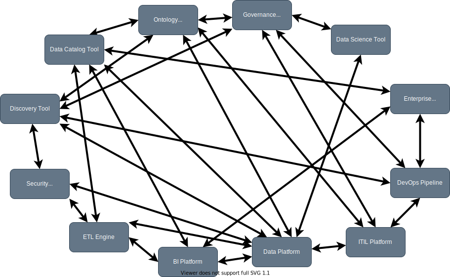
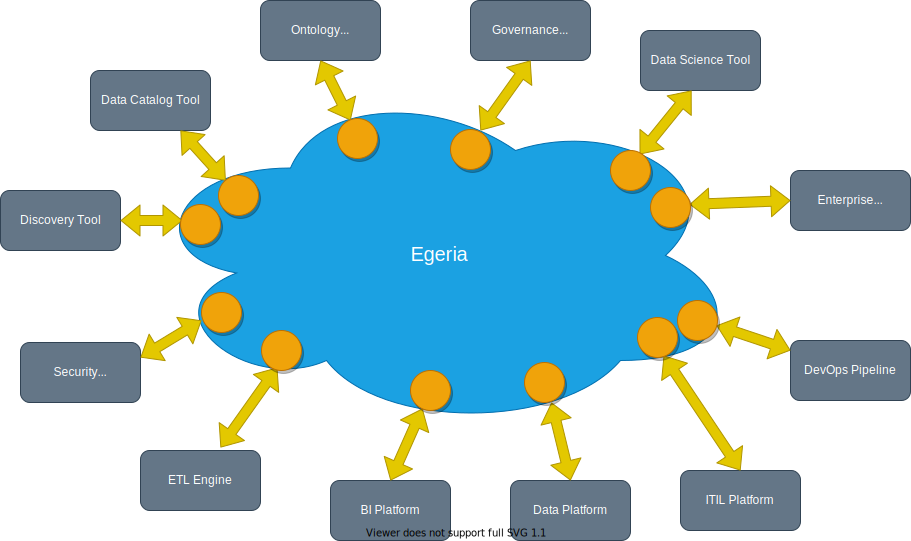
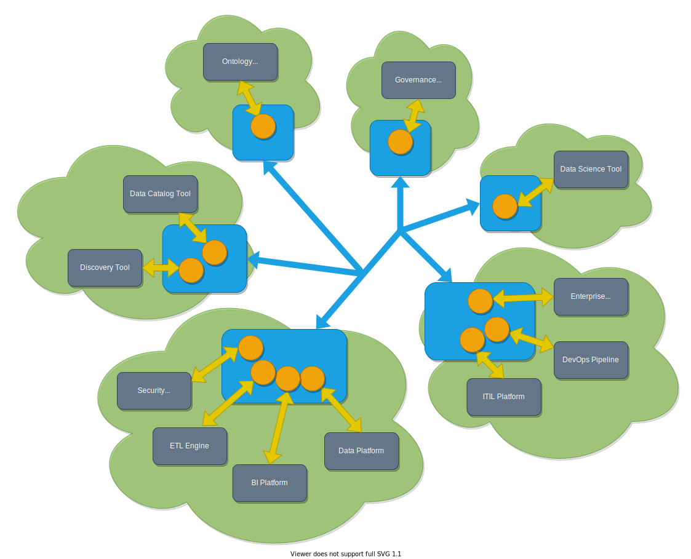

# Overview

## 1. System Purpose

Modern organizations rely on dozens of specialized tools — catalogs, analysis platforms, lineage trackers, governance suites — each storing metadata in its own proprietary format. These isolated silos cannot communicate with one another, forcing companies into expensive point-to-point integrations where every pair of tools needs a custom connection.

*Figure 1 — Fragmented metadata ecosystem before Egeria*

**Egeria** solves this by acting as an open metadata hub: each tool needs only one link to Egeria, and Egeria manages the complexity of the exchange. The link is a **connector** (the orange circles in Figure 2), a component that translates between the tool's proprietary format and Egeria's **Open Metadata Types**.

*Figure 2 — The Egeria concept: one connector per tool as the translation bridge*

In short, Egeria's role is to receive metadata from any connected tool, normalize it into a common open format, and redistribute it so that every other system in the organization stays informed — acting as a universal translator that turns fragmented, proprietary knowledge into a shared, continuously updated resource.

---

## 2. Principal Stakeholders

| Stakeholder | Role |
|---|---|
| **Data engineers & scientists** | Use the metadata catalog to discover datasets, understand lineage, and assess quality before building pipelines or models |
| **Data stewards & governance officers** | Define and maintain business glossaries, data policies, and compliance controls ensuring responsible data use |
| **Tool vendors & integrators** | Develop integration connectors so their platforms can exchange metadata through Egeria's open standards |
| **Enterprise architects** | Design organization-wide data governance strategies, leveraging Egeria as a unified metadata layer |
| **Contributors & maintainers** | 63 contributors and 14 active maintainers from organizations including IBM, ING, SAS, and PDR Associates |
| **Linux Foundation / ODPi** | Governing body ensuring open-source compliance and healthy community operations |

---

## 3. System Description

### 3.1 Functional Overview

Egeria’s highly configurable platform supports multi-tenancy, allowing multiple organizations to run independent instances simultaneously. This is managed via virtual **Open Metadata and Governance (OMAG) servers**, each specialized for specific tasks:

*Figure 3 — OMAG Platform with its server types*

- **Metadata Access Server** — provides services for the **Open Metadata Repositories** and metadata change events (sent on the **OutTopic**) for other servers.
- **Integration Daemon** — hosts the integration connectors that continuously synchronize metadata between Egeria and external tools.
- **Engine Host** — executes automated governance tasks such as metadata surveys, quality checks, and watchdog monitoring that respond to metadata changes.
- **View Server** — provides the REST APIs to maintaining/query open metadata and to initiate/control governance actions.
- **Repository Proxy** — allows third-party metadata repositories to participate in an Egeria federation without migrating their data.

**Content packs** (`.omarchive` files) are ready-to-use packages that add new metadata types, reference data, and governance configurations to the platform. Once loaded, their content is immediately activated by the runtime.

**How metadata flows.** When metadata changes in a source tool, its connector writes the update to the **Metadata Access Server**, which publishes an event on a notification channel. All other connectors receive this event and update their respective tools, keeping the entire ecosystem synchronized.

*Figure 4 — Bidirectional metadata exchange through Egeria connectors*

For enterprises operating tools across multiple data centers, multiple platforms can join an **[Open Metadata Repository Cohort](https://egeria-project.org/features/cohort-operation/overview/)** — a collection of servers sharing metadata using a peer-to-peer exchange protocol. Once a server becomes a member of the cohort, it can share metadata with, and receive metadata from, any other member either via events or **federated queries**.

*Figure 5 — Distributed operation: multiple OMAG platforms in a federated cohort*

### 3.2 Technical Description

The source repository is organized into top-level modules, each serving a distinct purpose:

| Folder | Purpose |
|---|---|
| `open-metadata-implementation/` | Core source code split into 14 sub-modules that implement all platform services, APIs, and connectors |
| `open-metadata-resources/` | Samples, utilities, and developer-oriented resources to help contributors get started |
| `open-metadata-conformance-suite/` | Conformance test suite validating correct implementation of Egeria's APIs and repository behaviors |
| `open-metadata-distribution/` | Docker images and platform distribution packages used for deployment |
| `content-packs/` | 25 pre-built `.omarchive` content packs ready for immediate loading |

The `open-metadata-implementation/` module is further divided into **14 sub-modules**:

| Sub-module | Responsibility |
|---|---|
| `access-services` (OMAS) | REST APIs supporting the framework interfaces, running in the metadata access servers |
| `adapters` | Pre-written pluggable components for the frameworks, enabling calls to third-party technology |
| `admin-services` | APIs for configuring and operating OMAG Servers on the platform |
| `common-services` | First Failure Data Capture (FFDC), multi-tenancy support, metadata security, and management services |
| `engine-services` (OMES) | Hosting support for governance engines running in the Engine Host server |
| `frameworks` | Interfaces for pluggable components such as connectors, discovery services, and governance actions |
| `governance-server-services` | Specialist services supporting the different types of governance servers on the platform |
| `platform-chassis` | Base component and web server receiving REST API requests for the platform |
| `platform-services` | APIs for configuring the platform and discovering information about hosted servers |
| `repository-services` (OMRS) | Events, interfaces, and implementation of metadata exchange and federation capabilities |
| `server-operations` | Starting and shutdown of OMAG Servers on the platform |
| `view-server-generic-services` | Basic user interfaces to demonstrate open metadata and governance capabilities |
| `user-security` | Token-based authentication and authorization for the platform |
| `view-services` (OMVS) | Domain-specific services for tools and platforms maintaining and retrieving metadata |

---

## 4. Code Statistics

### 4.1 Language Breakdown

| Language | Files | LOC | Comments | Blanks |
|---|---|---|---|---|
| **Java** | 4,090 | 556,759 | 302,020 | 144,519 |
| Markdown | 600 | 14,097 | 0 | 5,963 |
| Gradle | 246 | 7,418 | 385 | 1,284 |
| JSON | 8 | 1,421 | 0 | 3 |
| Other | 236 | 6,280 | 1,043 | 2,693 |
| **Total** | **5,180** | **585,975** | **303,448** | **152,462** |

### 4.2 Summary Metrics

| Metric | Value |
|---|---|
| Total files / LOC | 5,180 / 585,975 |
| Total lines (all content) | 1,041,885 |
| Primary language | Java (~95% of LOC) |
| Contributors / Maintainers | 63 / 14 |
| Total releases | 50 (v1.0 – v6.0) |
