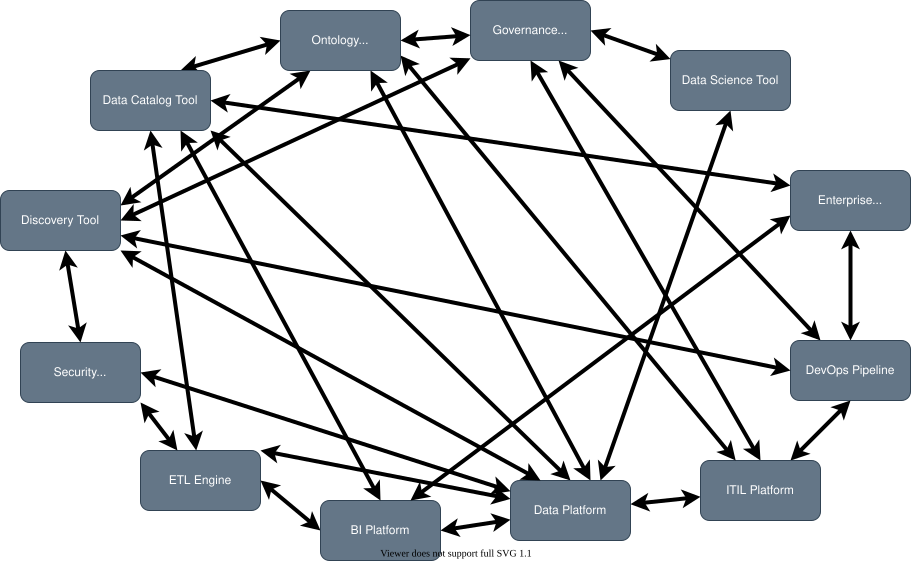
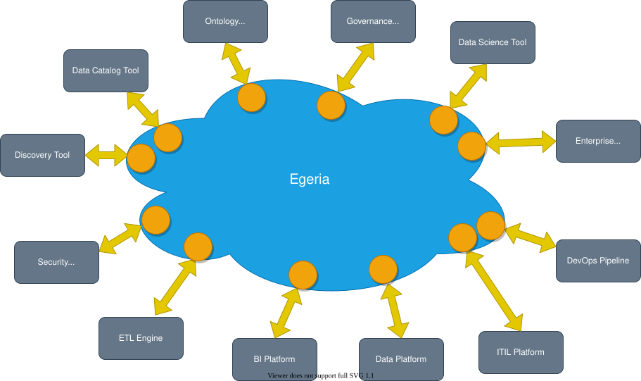
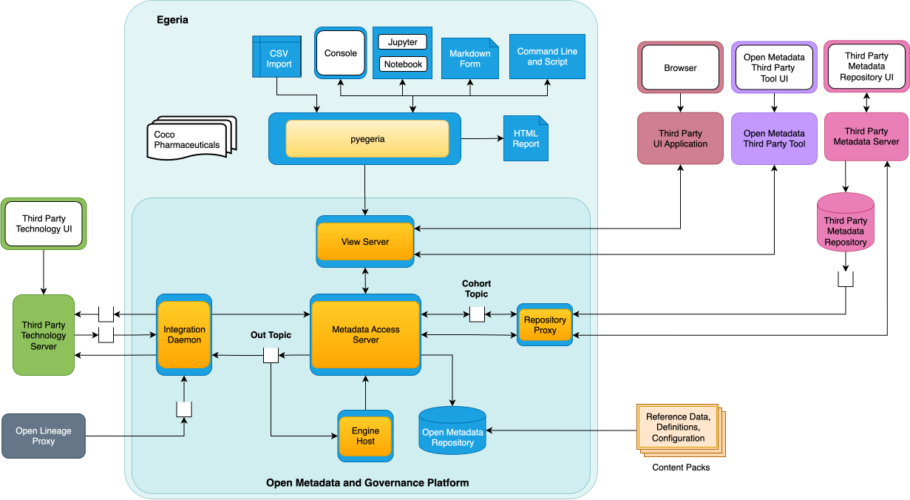
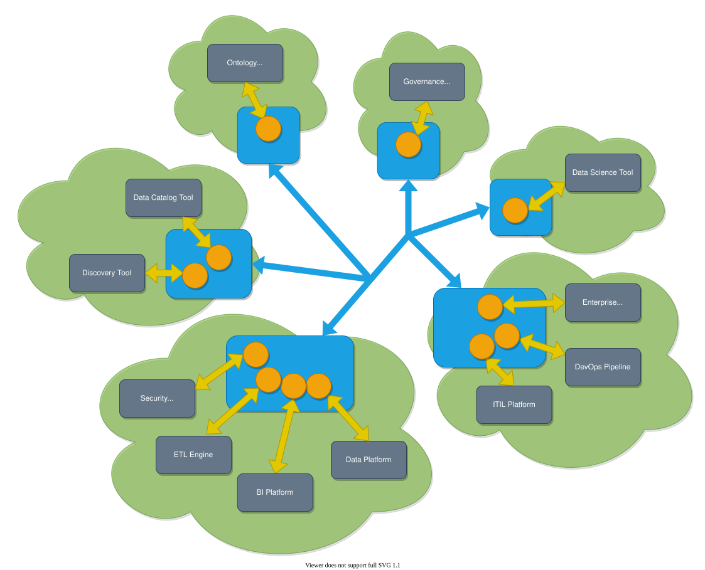

# Overview

## System Purpose

Modern organizations rely on dozens of specialized tools — catalogs, analysis platforms, lineage trackers, governance suites — each storing metadata in its own proprietary format. These isolated silos cannot communicate with one another, forcing companies into expensive point-to-point integrations where every pair of tools needs a custom connection.

*Figure 1 — Fragmented metadata ecosystem before Egeria*

**Egeria** solves this by acting as an open metadata hub: each tool needs only one link to Egeria, and Egeria manages the complexity of the exchange. The link is a **connector** (the orange circles in Figure 2), a component that translates between the tool's proprietary format and Egeria's **Open Metadata Types**.

*Figure 2 — Egeria concept: one connector per tool as the translation bridge*

In short, Egeria's role is to receive metadata from any connected tool, normalize it into a common open format, and redistribute it so that every other system in the organization stays informed — acting as a universal translator that turns fragmented, proprietary knowledge into a shared, continuously updated resource.

---

## Principal Stakeholders

| Stakeholder | Role |
|---|---|
| **Data engineers & scientists** | Use the metadata catalog to discover datasets, understand lineage, and assess quality before building pipelines or models |
| **Data stewards & governance officers** | Define and maintain business glossaries, data policies, and compliance controls ensuring responsible data use |
| **Tool vendors & integrators** | Develop integration connectors so their platforms can exchange metadata through Egeria's open standards |
| **Enterprise architects** | Design organization-wide data governance strategies, leveraging Egeria as a unified metadata layer |
| **Contributors & maintainers** | 63 contributors and 14 active maintainers from organizations including IBM, ING, SAS, and PDR Associates |
| **Linux Foundation / ODPi** | Governing body ensuring open-source compliance and healthy community operations |

---

## System Description

### Functional Overview

Egeria’s highly configurable platform supports multi-tenancy, allowing multiple organizations to run independent metadata solution in the same platform instance. This is managed via virtual **Open Metadata and Governance (OMAG) Servers**, each specialized for specific tasks:

*Figure 3 — OMAG Platform*

- **Metadata Access Server**: Provides services for the **Open Metadata Repositories** and metadata change events (sent on the **OutTopic**) for other servers.
- **Integration Daemon**: Hosts the integration connectors that continuously synchronize metadata between Egeria and external tools.
- **Engine Host**: Executes automated governance tasks such as metadata surveys, quality checks, and watchdog monitoring that respond to metadata changes.
- **View Server**: Provides the REST APIs to maintaining/query open metadata and to initiate/control governance actions.
- **Repository Proxy**: Allows third-party metadata repositories to participate in an Egeria federation without migrating their data.

**Content packs** (`.omarchive` files) are ready-to-use packages that add new metadata types, reference data, and governance configurations to the platform. They are formatted as Open Metadata Archives and can be loaded at server start up or while the server is running.

**How metadata flows.** When metadata changes in a source tool, its connector writes the update to the **Metadata Access Server**, which publishes an event on a notification channel. All other connectors receive this event and update their respective tools, keeping the entire ecosystem synchronized.

Egeria handles metadata synchronization primarily through governance rules and authoritative sources rather than automatic conflict resolution mechanisms. When concurrent updates occur on the same metadata element, conflicts are typically resolved by giving precedence to the designated authoritative source or through stewardship processes, ensuring consistency across federated repositories.

*Figure 4 — Bidirectional metadata exchange through Egeria connectors*

For enterprises operating tools across multiple data centers, multiple platforms can join an **[Open Metadata Repository Cohort](https://egeria-project.org/features/cohort-operation/overview/)** — a collection of servers sharing metadata using a peer-to-peer exchange protocol. Once a server becomes a member of the cohort, it can share metadata with, and receive metadata from, any other member either via events or **federated queries**.

*Figure 5 — Distributed operation: multiple OMAG platforms in a federated cohort*

### Technical Description

The source repository is organized into top-level modules, each serving a distinct purpose:

| Folder | Purpose |
|---|---|
| `open-metadata-implementation/` | Core source code split into 14 sub-modules that implement all platform services, APIs, clients and connectors. |
| `open-metadata-resources/` | Samples, utilities, and developer-oriented resources to help contributors get started. |
| `open-metadata-conformance-suite/` | Conformance test suite validating correct implementation of Egeria's APIs and repository behaviors. |
| `open-metadata-distribution/` | Docker images and platform distribution packages used for deployment. |
| `content-packs/` | 25 pre-built `.omarchive` content packs ready for immediate loading. |

The `open-metadata-implementation/` module is further divided into **14 sub-modules**:

| Sub-module | Responsibility |
|---|---|
| `access-services` (OMAS) | The access services provide REST APIs to support the interfaces defined in the frameworks.  The access services run in either the metadata access point server or metadata server on the OMAG Server Platform.  They call the repository services and the common services. |
| `adapters` | The adapters provide the pre-written pluggable components that fit into the framework (see below).  These components allow calls to third party technology to be made from the Egeria OMAS Server Platform.  Some of these components are to support the operation of Egeria and others are to enable Egeria to connect to third party technology to exchange metadata or govern its assets. |
| `admin-services` | The admin services provides the APIs for configuring and operating Open Metadata and Governance (OMAG) Servers that run on the OMAG Server Platform. |
| `common-services` | A variety of common services from First Failure Data Capture (FFDC), multi-tenancy (for the platform) along with metadata security and management.  Some of these services are client-side and other server-side. |
| `engine-services` (OMES) | The engine services support the hosting of different types of governance engines that can be hosted in the engine host governance server on the OMAG Server Platform. |
| `frameworks` | The frameworks define the interfaces for pluggable components such as connectors, discovery services and governance actions. These components provide much of the customization offered by the open metadata and governance implementation. |
| `governance-server-services` | The governance server services provide the specialist services that support the different types of governance servers that can run in the OMAG Server Platform. |
| `platform-chassis` | The platform chassis is the base component for the  [OMAG Server Platform](https://egeria-project.org/concepts/omag-server-platform/). It includes the web server that receives the REST API requests for both the OMAG Server Platform and the [OMAG Servers](https://egeria-project.org/concepts/omag-server/) that run on it. |
| `platform-services` | The platform services provides the APIs for configuring the Open Metadata and Governance (OMAG) Server Platform and discovering information about the [OMAG Servers](https://egeria-project.org/concepts/omag-server/) that it is hosting. |
| `repository-services` (OMRS) | The repository services provides the events, interfaces and implementation of the metadata exchange and federation capabilities for a metadata repository that supports the open metadata standards. |
| `server-operations` | The server operations supports the starting and shutdown of OMAG Servers on either the OMAG Server Platform or OMAG Server Runtime. |
| `view-server-generic-services` | Basic user interfaces to demonstrate the power of the open metadata and governance capabilities. |
| `user-security` | Modules to enable token-based authentication/authorization for the OMAG Server Platform and OMAG Server Runtime. |
| `view-services` (OMVS) | The view services provide domain-specific services for data tools, engines and platforms that maintaining and retrieving metadata. These services run in a view server on the OMAG Server Platform. |

---

## Code Statistics

### Language Breakdown

| Language | Files | LOC | Comments | Blanks |
|---|---|---|---|---|
| **Java** | 4,090 | 556,759 | 302,020 | 144,519 |
| Markdown | 600 | 14,097 | 0 | 5,963 |
| Gradle | 246 | 7,418 | 385 | 1,284 |
| JSON | 8 | 1,421 | 0 | 3 |
| Other | 236 | 6,280 | 1,043 | 2,693 |
| **Total** | **5,180** | **585,975** | **303,448** | **152,462** |

### Summary Metrics

| Metric | Value |
|---|---|
| Total files / LOC | 5,180 / 585,975 |
| Total lines (all content) | 1,041,885 |
| Primary language | Java (~95% of LOC) |
| Contributors / Maintainers | 63 / 14 |
| Total releases | 50 (v1.0 – v6.0) |
