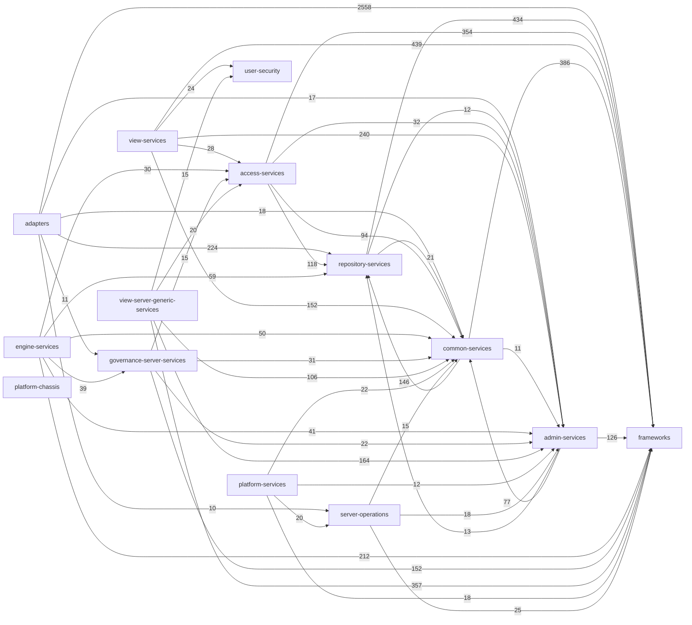

# A1 — Code Dependencies

## Methodology

**[Depends](https://github.com/multilang-depends/depends)** (v0.9.7) was used for the initial static analysis of the source code, producing a JSON dependency matrix; a custom Python script (`analyze_dependencies.py`) then processed this output to compute the final statistics.

---

## File Dependency Rankings

### Highest Outgoing Imports

| Imports | File |
|---------|------|
| 56 | `nanny-connectors/.../JacquardIntegrationConnector.java` |
| 51 | `repository-services-apis/.../OMRSMetadataCollection.java` |
| 51 | `open-metadata-framework/.../OpenMetadataPropertyConverterBase.java` |

`JacquardIntegrationConnector` ranks highest because it assembles the **Open Metadata Digital Product Catalog**, managing digital products across a single class: product catalogs, solution blueprints, reference data sets, governance actions, communities, glossaries, and data dictionaries. Each concern introduces its own set of property beans, elements, and context types.

### Lowest Outgoing Imports

| Imports | File |
|---------|------|
| 1 | `community-matters-spring/.../CommunityMattersResource.java` |
| 1 | `open-metadata-framework/.../DataMappingProperties.java` |
| 1 | `open-metadata-framework/.../ConceptBeadAttributeProperties.java` |

`CommunityMattersResource` ranks lowest because it is the server-side REST controller for **Community Matters OMVS**: it only exposes HTTP endpoints and immediately delegates each call to `CommunityMattersRESTServices`. Since all logic is delegated to `CommunityMattersRESTServices`, this class never touches Egeria types directly — `CommunityMattersRESTServices` is the only explicit Egeria import it declares.

### Most Imported Files

| Imported by | File |
|-------------|------|
| 863 | `open-metadata-framework/.../OpenMetadataType.java` |
| 631 | `audit-log-framework/.../AuditLog.java` |
| 574 | `open-metadata-framework/.../InvalidParameterException.java` |

---

## Observed Structural (Code-Level) Dependencies

### Implementation Dependency

- **Source:** `egeria-system-connectors/.../OMAGServerPlatformCatalogConnector.java`
- **Depends on:** `open-metadata-framework/.../SoftwareServerProperties.java`

The connector pattern-matches against the concrete type and calls methods on it directly:

```java
if (softwareServer.getProperties()
        instanceof SoftwareServerProperties softwareServerProperties)
    softwareServerProperties.getDeployedImplementationType();
```

### Construction Dependency

- **Source:** `egeria-system-connectors/.../OMAGServerPlatformCatalogConnector.java`
- **Depends on:** `open-metadata-framework/.../SoftwareServerProperties.java`

The connector directly instantiates `SoftwareServerProperties` via `new` and populates it before use:

```java
SoftwareServerProperties softwareServerProperties = new SoftwareServerProperties();
softwareServerProperties.setQualifiedName(…);
```

### Compile-Time Dependency

- **Source:** `common-services/multi-tenant/.../OMAGServerInstanceAuditCode.java`
- **Depends on:** `audit-log-framework/.../AuditLogMessageSet.java`

The enum declares `AuditLogMessageSet` only in its type signature — no calls or instantiations, purely a compiler-level contract:

```java
public enum OMAGServerInstanceAuditCode implements AuditLogMessageSet { … }
```

---

## Module Dependency Graph

> Edge weights = total `Import` count between submodules of `open-metadata-implementation`. Only edges with ≥ 10 imports are shown.


