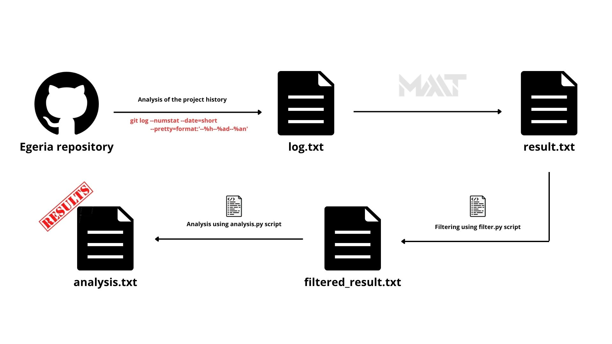

# Design — Section A2: Knowledge Dependencies

> **Owner:** Luca Ferrone  
> **Status:** To be completed

<!-- 
Required content:
- Co-change analysis: files modified together in the same commits
- Knowledge dependencies NOT consistent with code dependencies (A1)
- Explanation of anomalies found
- Diagram: ../../../diagrams/dependencies/knowledge-dependencies.puml
-->

<!-- 
Contenuto personale per ricordami cosa ho fatto:

come ho fatto l'analisi:

ho generato i file di log della storia di egeria e li ho salvati in analysis/data/co-dependencies/co_dependencies_log.txt

con code-maat ho generato un file per l'analisi delle co_dipendenze -> analysis/data/co-dependencies/co_dependencies_result.txt

successivamento ho filtrato i dati con un degree > 40 usando analysis/scripts/co-dependencies/co_dependencies_filter.py e salvando i dati in analysis/data/co-dependencies/filtered_results.txt

poi ho usato uno script di analisi che trasformava le tuple di filtered_result.txt in un grafo e mi mostrava hub, file più accoppiati e clusters più importanti, salvando il risultato in analysis/data/co-dependencies/co_dependencies_analysis_results.txt
-->

<!-- Official report -->

The co-dependency analysis was performed using CodeMaat, following this workflow:

Using file `analysis.txt`, I derived the following conclusions.

  

## Hub analysis

### Content packs (.omarchive)
These files contain definitions of data models. If you change the data model, you need to update almost everything else.

### open-metadata-conformance-suite
The testing system is deeply integrated. It's a sign of software maturity, but it also indicates that every change to the core APIs requires a massive update of compliance testing.

### Infrastructure & DevOps
Files like Dockerfile, build.gradle, and GitHub workflows show a co-dependency related to the build and deployment process.

  

## Coupling analysis

### Content packs (.omarchive)
Content pack files have 100% of coupling, this means that there is a very high cohesion between the content packages. 
This suggests that, although they are physically separate, they logically form a single information block. 
Splitting these dependencies in the future may be difficult.

### Enterprise Executors 
Search executors (e.g., FindEntitiesByClassificationExecutor vs FindEntitiesByPropertyValueExecutor) show very high coupling (100%–92%).
This suggests code duplication or highly similar logic (if a bug appears in one, it is likely present in the other as well).
It can be usefull estract common logic in a unique class.

### .gradle and .config files
Co-changes among configuration files are expected, but frequent or widespread coupling may indicate tight module dependencies (.gradle) or duplicated configuration logic (.config), reducing maintainability.

  

## Clusters analysis
From the cluster analysis, no additional anomalies were identified.

   
   

## Inconsistencies with code dependencies
